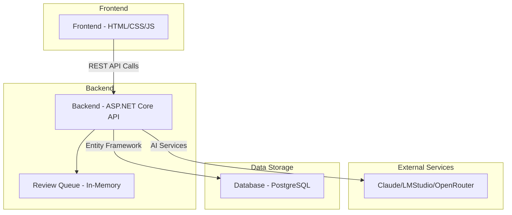

# AI Project Orchestrator - System Analysis

## Overview
The AI Project Orchestrator is a sophisticated system designed to automate software project planning and development using AI assistance. It follows a multi-stage workflow that transforms high-level project descriptions into executable code through AI-generated artifacts, with human review checkpoints at each stage.

## System Architecture

## Detailed Component Analysis

### 1. Frontend (Client-Side)
The frontend is a client-side web application built with HTML, CSS, and JavaScript that provides the user interface for interacting with the system.

**Key Components:**
- Static HTML pages for different views (dashboard, project list, workflow, etc.)
- JavaScript API client for communicating with the backend
- Workflow management system with Postgres persistence via EF Core
- Responsive design for various screen sizes

**Main Pages:**
- `index.html` - Dashboard with project overview and navigation
- `projects/list.html` - List of all projects with status information
- `projects/create.html` - Form for creating new projects
- `projects/workflow.html` - Main workflow interface for managing project stages
- `projects/stories-overview.html` - Interface for managing user stories and prompts
- `reviews/queue.html` - Review queue for approving AI-generated artifacts

### 2. Backend (Server-Side)
The backend is built with ASP.NET Core and follows a clean architecture pattern with separate layers for API, Application, Domain, and Infrastructure.

**Key Components:**
- RESTful API controllers for each domain entity
- Application services implementing business logic
- Domain entities and interfaces defining the core model
- Infrastructure layer with database repositories and AI client implementations
- Dependency injection for loose coupling between components
- Health checks for monitoring service status

**Main API Controllers:**
- `ProjectsController` - CRUD operations for projects
- `RequirementsController` - Requirements analysis generation and management
- `ProjectPlanningController` - Project planning document generation
- `StoriesController` - User story generation
- `PromptGenerationController` - AI coding prompt generation
- `ReviewController` - Review queue management
- `CodeController` - Code generation (final stage)

### 3. Database (PostgreSQL)
The system uses PostgreSQL for persistent data storage with Entity Framework Core as the ORM.

**Key Entities:**
- `Project` - Core entity representing a software project
- `RequirementsAnalysis` - AI-generated requirements document
- `ProjectPlanning` - AI-generated project planning document
- `StoryGeneration` - Collection of AI-generated user stories
- `PromptGeneration` - AI-generated coding prompts for user stories
- `Review` - Review queue items for human approval

**Relationships:**
- One-to-Many: Project → RequirementsAnalysis
- One-to-Many: RequirementsAnalysis → ProjectPlanning
- One-to-Many: ProjectPlanning → StoryGeneration
- One-to-Many: StoryGeneration → PromptGeneration
- One-to-One: Each artifact entity → Review (for approval workflow)

## User Workflow

The user workflow follows a linear, multi-stage process with review checkpoints:

### Stage 1: Project Creation
1. User creates a new project via the frontend form
2. Project data is sent to the backend API
3. Backend creates a new Project entity in the database
4. User is redirected to the project workflow page

### Stage 2: Requirements Analysis
1. User initiates requirements analysis from the workflow page
2. Frontend sends project description to the Requirements API
3. Backend service generates requirements using AI providers
4. Generated requirements are stored in the database
5. A review item is created in the review queue
6. User is redirected to the review queue to approve the requirements

### Stage 3: Project Planning
1. After requirements approval, user can initiate project planning
2. Frontend requests planning generation via the ProjectPlanning API
3. Backend generates project plan based on approved requirements
4. Plan is stored in the database with a new review queue item
5. User reviews and approves the plan in the review queue

### Stage 4: User Story Generation
1. After planning approval, user can generate user stories
2. Frontend requests story generation via the Stories API
3. Backend creates user stories based on the approved plan
4. Stories are stored in the database with a review item
5. User reviews and approves the stories in the review queue

### Stage 5: Prompt Generation
1. After story approval, user manages individual story prompts
2. Frontend navigates to stories overview page
3. For each story, user can generate coding prompts
4. Prompts are generated via the PromptGeneration API
5. Each prompt goes through the review process

### Stage 6: Code Generation
1. After prompt approval, user can generate code
2. Frontend requests code generation via the Code API
3. Backend generates code based on approved prompts
4. Code is delivered to the user (final output)

## Component Interactions

### Frontend ↔ Backend
- Communication occurs via RESTful API calls using JSON
- Frontend uses a custom API client (`api.js`) for all backend interactions
- All API calls include proper error handling and user feedback
- Authentication is handled via CORS configuration (no explicit auth in current implementation)

### Backend ↔ Database
- Entity Framework Core is used for all database operations
- Repositories implement the repository pattern for data access
- Database context (`AppDbContext`) defines entity relationships
- Migrations are applied automatically in development environments

### Backend ↔ AI Services
- HTTP clients are configured for different AI providers (Claude, LMStudio, OpenRouter)
- AI client factory allows for dynamic provider selection
- Requests are sent with appropriate timeouts and error handling
- Responses are processed and stored as domain entities

### Review Process
- When any AI-generated artifact is created, a review item is automatically added to the queue
- Review items are stored in-memory (not in the database) for temporary storage
- Users can approve or reject items in the review queue
- Upon approval, the corresponding entity status is updated in the database
- Background service periodically cleans up old review items

## Key Features

1. **Multi-Stage Workflow**: Linear process with clear stages and dependencies
2. **Human-in-the-Loop**: Review queue ensures human approval at each stage
3. **AI Integration**: Multiple AI providers supported for redundancy
4. **Persistent Storage**: PostgreSQL database stores all project artifacts
5. **State Management**: Frontend maintains workflow state in Postgres via EF Core
6. **Responsive UI**: Clean, modern interface that works on different devices
7. **Error Handling**: Comprehensive error handling throughout the application
8. **Health Monitoring**: Built-in health checks for system components

## Data Flow

This system provides a complete workflow for transforming project ideas into AI-assisted software development, with appropriate checkpoints for human oversight and quality control.
