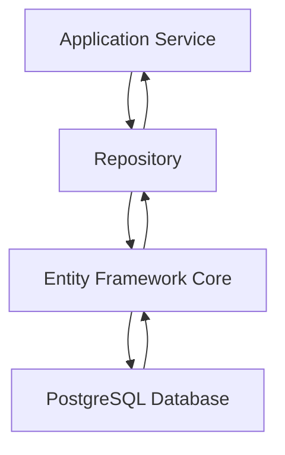

# PostgreSQL Integration in AI Project Orchestrator

## Overview
The AI Project Orchestrator uses PostgreSQL as its primary data storage solution, implemented through Entity Framework Core. This document provides a comprehensive analysis of how PostgreSQL is integrated into the system, including configuration, entity mapping, repository pattern implementation, and data access patterns.

## Database Configuration

### Connection Strings
The system defines PostgreSQL connection strings in two configuration files:

1. **appsettings.json** (Production/Default):
   ```
   Host=db;Port=5432;Database=aiprojectorchestrator;Username=user;Password=password
   ```

2. **appsettings.Development.json** (Development):
   ```
   Host=localhost;Port=5432;Database=aiprojectorchestrator;Username=user;Password=password
   ```

The main difference between the two configurations is the host:
- Production uses `db` (likely a Docker service name)
- Development uses `localhost` (local PostgreSQL instance)

### Database Context Registration
In `Program.cs`, the database context is registered with the dependency injection container:

```csharp
builder.Services.AddDbContext<AppDbContext>(options =>
    options.UseNpgsql(builder.Configuration.GetConnectionString("DefaultConnection")));
```

This configuration:
1. Uses the Npgsql provider for Entity Framework Core
2. Retrieves the connection string from configuration
3. Registers `AppDbContext` as a service

### Automatic Migrations
In development environments, the system automatically applies database migrations on startup:

```csharp
if (app.Environment.IsDevelopment())
{
    // Apply migrations on startup in development
    using (var scope = app.Services.CreateScope())
    {
        var context = scope.ServiceProvider.GetRequiredService<AppDbContext>();
        context.Database.Migrate();
    }
}
```

## Entity Framework Core Implementation

### Database Context
The `AppDbContext` class defines the database schema and relationships:

```csharp
public class AppDbContext : DbContext
{
    public AppDbContext(DbContextOptions<AppDbContext> options) : base(options)
    {
    }

    public DbSet<Project> Projects => Set<Project>();
    public DbSet<RequirementsAnalysis> RequirementsAnalyses => Set<RequirementsAnalysis>();
    public DbSet<ProjectPlanning> ProjectPlannings => Set<ProjectPlanning>();
    public DbSet<StoryGeneration> StoryGenerations => Set<StoryGeneration>();
    public DbSet<PromptGeneration> PromptGenerations => Set<PromptGeneration>();
    public DbSet<Review> Reviews => Set<Review>();
    
    // ... OnModelCreating implementation
}
```

### Entity Relationships
The `OnModelCreating` method defines the relationships between entities:

1. **Project → RequirementsAnalysis** (One-to-Many)
   - Cascade delete behavior
   - Indexed by AnalysisId (unique)

2. **RequirementsAnalysis → ProjectPlanning** (One-to-Many)
   - Cascade delete behavior
   - Indexed by PlanningId (unique)

3. **ProjectPlanning → StoryGeneration** (One-to-Many)
   - Cascade delete behavior
   - Indexed by GenerationId (unique)

4. **StoryGeneration → PromptGeneration** (One-to-Many)
   - Cascade delete behavior
   - Indexed by PromptId (unique)

5. **Entity → Review** (One-to-One)
   - Each artifact entity has a corresponding review
   - Cascade delete behavior
   - Reviews are indexed by ReviewId (unique), ServiceName, PipelineStage, and Status

### Indexes
Several indexes are defined for performance optimization:
- Unique indexes on ID fields (AnalysisId, PlanningId, GenerationId, PromptId, ReviewId)
- Non-unique indexes on Review entity fields (ServiceName, PipelineStage, Status)

## Repository Pattern Implementation

### Generic Repository
A generic `Repository<T>` class provides basic CRUD operations:

```csharp
public class Repository<T> : IRepository<T> where T : class
{
    protected readonly AppDbContext _context;
    protected readonly DbSet<T> _dbSet;

    public async Task<T> GetByIdAsync(int id, CancellationToken cancellationToken = default)
    public async Task<T> GetByStringIdAsync(string id, CancellationToken cancellationToken = default)
    public async Task<IEnumerable<T>> GetAllAsync(CancellationToken cancellationToken = default)
    public async Task<T> AddAsync(T entity, CancellationToken cancellationToken = default)
    public async Task UpdateAsync(T entity, CancellationToken cancellationToken = default)
    public async Task DeleteAsync(int id, CancellationToken cancellationToken = default)
}
```

### Specialized Repositories
Each entity has a specialized repository that extends the generic repository:

```csharp
public class ProjectRepository : Repository<Project>, IProjectRepository
public class RequirementsAnalysisRepository : Repository<RequirementsAnalysis>, IRequirementsAnalysisRepository
// ... other specialized repositories
```

These specialized repositories can add entity-specific methods while inheriting the basic CRUD operations.

## Data Access Patterns

### Dependency Injection
Repositories are registered as scoped services in `Program.cs`:

```csharp
builder.Services.AddScoped<IProjectRepository, ProjectRepository>();
builder.Services.AddScoped<IRequirementsAnalysisRepository, RequirementsAnalysisRepository>();
builder.Services.AddScoped<IProjectPlanningRepository, ProjectPlanningRepository>();
builder.Services.AddScoped<IStoryGenerationRepository, StoryGenerationRepository>();
builder.Services.AddScoped<IPromptGenerationRepository, PromptGenerationRepository>();
builder.Services.AddScoped<IReviewRepository, ReviewRepository>();
```

### Service Layer Usage
Application services use repositories through dependency injection:

```csharp
public class ProjectService(IProjectRepository projectRepository) : IProjectService
{
    public async Task<Project> CreateProjectAsync(Project project)
    {
        return await projectRepository.AddAsync(project);
    }
    
    // ... other methods
}
```

## Database Schema

### Core Entities

1. **Project**
   - Id (int, primary key)
   - Name (string)
   - Description (string)
   - CreatedDate (DateTime)
   - UpdatedDate (DateTime)
   - Navigation property to RequirementsAnalyses

2. **RequirementsAnalysis**
   - Id (int, primary key)
   - ProjectId (int, foreign key)
   - AnalysisId (string, unique)
   - Status (enum)
   - Content (string)
   - ReviewId (string)
   - CreatedDate (DateTime)
   - Navigation properties to Project and Review

3. **ProjectPlanning**
   - Id (int, primary key)
   - RequirementsAnalysisId (int, foreign key)
   - PlanningId (string, unique)
   - Status (enum)
   - Content (string)
   - ReviewId (string)
   - CreatedDate (DateTime)
   - Navigation properties to RequirementsAnalysis and Review

4. **StoryGeneration**
   - Id (int, primary key)
   - ProjectPlanningId (int, foreign key)
   - GenerationId (string, unique)
   - Status (enum)
   - Content (string)
   - ReviewId (string)
   - CreatedDate (DateTime)
   - Navigation properties to ProjectPlanning and Review

5. **PromptGeneration**
   - Id (int, primary key)
   - StoryGenerationId (int, foreign key)
   - StoryIndex (int)
   - PromptId (string, unique)
   - Status (enum)
   - Content (string)
   - ReviewId (string)
   - CreatedDate (DateTime)
   - Navigation properties to StoryGeneration and Review

6. **Review**
   - Id (int, primary key)
   - ReviewId (string, unique)
   - ServiceName (string)
   - PipelineStage (string)
   - Content (string)
   - Status (enum)
   - SubmittedAt (DateTime)
   - Metadata (Dictionary<string, object>)
   - Navigation properties to related entities

## Migration System

The system uses Entity Framework Core migrations to manage database schema changes:

1. **Migration Files**: Located in `src/AIProjectOrchestrator.Infrastructure/Migrations/`
2. **Initial Migration**: `20250906123741_InitialCreate.cs`
3. **Automatic Application**: Migrations are automatically applied in development environments

## Data Flow



## Key Features

1. **Clean Architecture**: Database access is abstracted through repositories
2. **Dependency Injection**: All database components are registered with DI container
3. **Entity Relationships**: Proper foreign key relationships with cascade deletes
4. **Indexing**: Performance optimization through strategic indexing
5. **Environment-Specific Configuration**: Different connection strings for development and production
6. **Automatic Migrations**: Schema updates applied automatically in development
7. **Async Operations**: All database operations are asynchronous
8. **Transaction Support**: Entity Framework Core provides transaction management

## Security Considerations

1. **Connection String Security**: Stored in configuration files (should be secured in production)
2. **Parameterized Queries**: Entity Framework Core uses parameterized queries to prevent SQL injection
3. **Access Control**: Repository pattern limits direct database access

## Performance Considerations

1. **Indexing**: Strategic indexes on frequently queried fields
2. **Async Operations**: Non-blocking database operations
3. **Connection Pooling**: Provided by Npgsql provider
4. **Lazy Loading**: Navigation properties enable efficient data retrieval

This PostgreSQL integration provides a robust, scalable data storage solution that supports the AI Project Orchestrator's workflow while maintaining clean separation of concerns through the repository pattern.