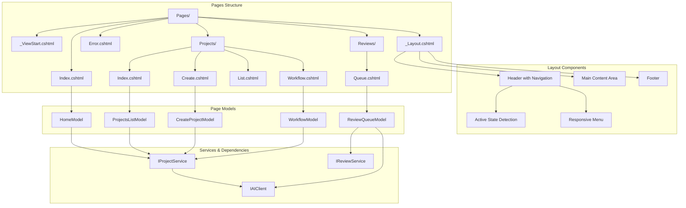
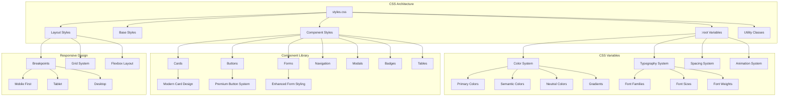
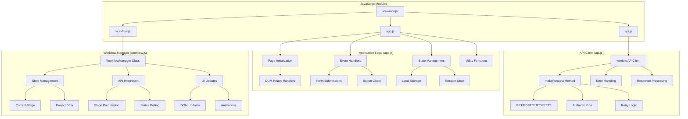
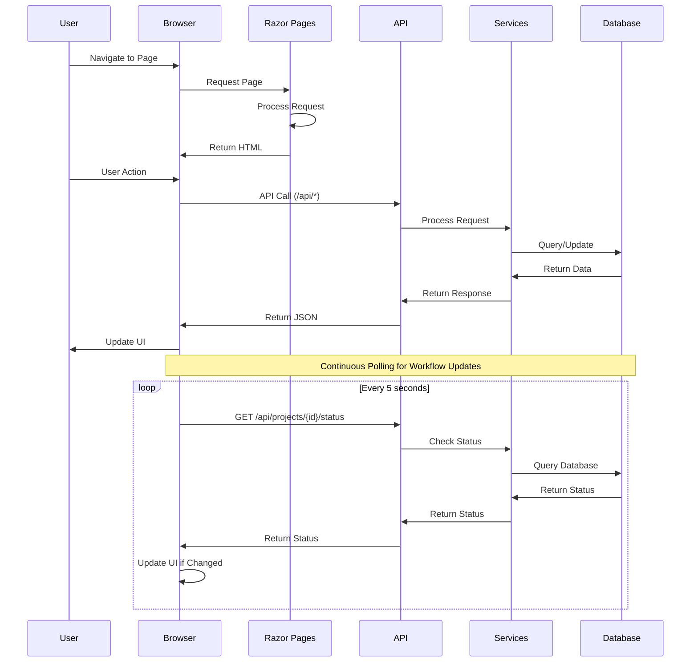
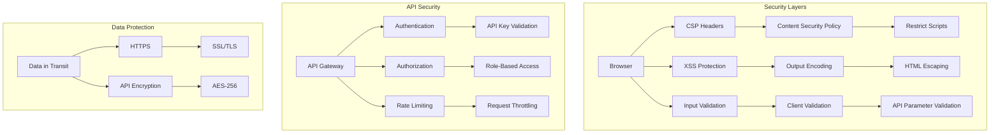
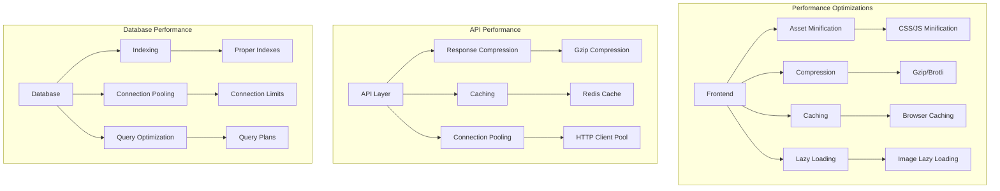

# Frontend Architecture Diagram

## System Architecture Overview

```mermaid
graph TB
    subgraph "Client Browser"
        A[User Request] --> B[Razor Pages Engine]
        B --> C{Page Request}
        C -->|Home| D[Pages/Index.cshtml]
        C -->|Projects| E[Projects/*.cshtml]
        C -->|Reviews| F[Reviews/Queue.cshtml]
        C -->|Error| G[Error.cshtml]
    end
    
    subgraph "ASP.NET Core Pipeline"
        B --> H[Static Files Middleware]
        B --> I[Razor Pages Middleware]
        B --> J[API Controllers Middleware]
        H --> K[wwwroot/]
        I --> L[Pages/]
        J --> M[Controllers/]
    end
    
    subgraph "Frontend Assets"
        K --> N[css/styles.css]
        K --> O[js/api.js]
        K --> P[js/app.js]
        K --> Q[js/workflow.js]
        L --> R[_Layout.cshtml]
        L --> S[Individual Page Views]
    end
    
    subgraph "API Integration"
        O --> T[/api]
        P --> T
        Q --> T
        T --> U[ProjectsController]
        T --> V[RequirementsController]
        T --> W[StoriesController]
        T --> X[ReviewController]
    end
    
    subgraph "Backend Services"
        U --> Y[ProjectService]
        V --> Z[RequirementsAnalysisService]
        W --> AA[StoryGenerationService]
        X --> AB[ReviewService]
    end
    
    subgraph "Data Layer"
        Y --> AC[ProjectRepository]
        Z --> AD[RequirementsAnalysisRepository]
        AA --> AE[StoryGenerationRepository]
        AB --> AF[ReviewRepository]
        AC --> AG[(PostgreSQL)]
        AD --> AG
        AE --> AG
        AF --> AG
    end
```

## Razor Pages Architecture



## CSS Architecture System



## JavaScript Architecture



## Data Flow Architecture



## Security Architecture



## Performance Architecture



This architecture provides a comprehensive view of how the new frontend will be structured and interact with the existing backend systems.